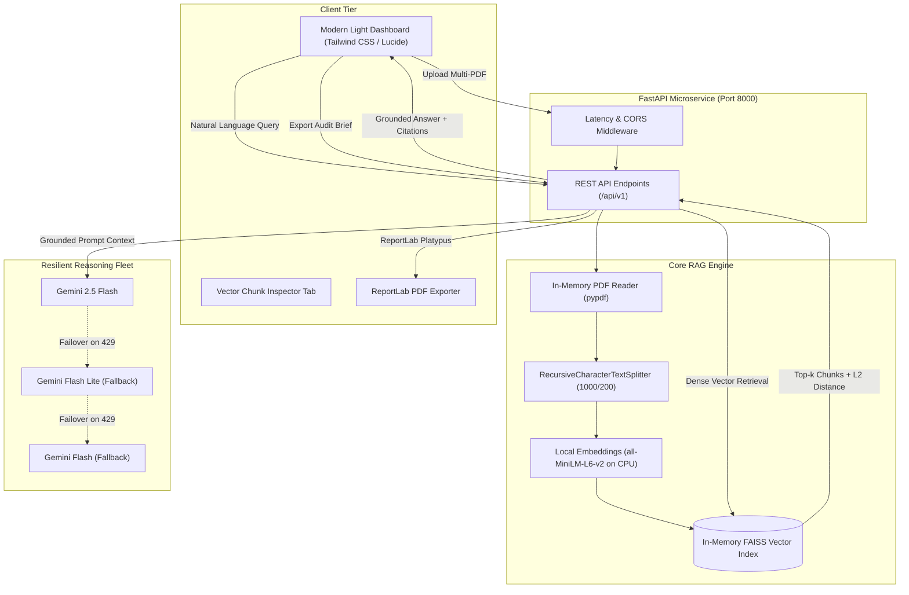

# DocuVault AI: Grounded Multi-Document RAG Microservice

[](https://github.com/Dhruv-Panwar042/DocuVault-AI/actions/workflows/ci.yml)
[](LICENSE)
[](https://www.python.org/downloads/)
[](https://fastapi.tiangolo.com)
[](Dockerfile)


A production-grade, decoupled Retrieval-Augmented Generation (RAG) microservice that enables grounded multi-document question answering, interactive vector chunk inspection, and executive briefing synthesis with automated ReportLab PDF export.

Built with **FastAPI**, **LangChain**, **FAISS-CPU**, local **`all-MiniLM-L6-v2`** embeddings (zero embedding API cost), and **Google Gemini 2.5 Flash** with resilient multi-model failover.

---

## 🎯 Key Engineering Highlights

1. **Zero Embedding API Cost (Local CPU ONNX Inference)**:
   - Uses `fastembed` ONNX Runtime (`sentence-transformers/all-MiniLM-L6-v2`) loaded locally on CPU.
   - Embeds 384-dimensional dense vectors with normalized cosine similarity without incurring commercial embedding API charges or hitting remote rate limits.
   - Highly optimized memory footprint (~120 MB RAM vs 500+ MB with PyTorch), fitting comfortably within free cloud container limits (e.g., Render 512 MB).

2. **In-Memory RAM Document Ingestion**:
   - Parses multi-file PDFs directly from memory byte buffers (`io.BytesIO`) using `pypdf`, eliminating slow disk I/O and file locking pitfalls on Windows and containerized environments.

3. **Grounded Answer Confidence Rating**:
   - Computes L2 similarity distance metrics for retrieved vector chunks and maps them to transparent confidence tiers:
     - **High Confidence**: L2 distance $\le 0.5$
     - **Medium Confidence**: L2 distance $\le 1.0$
     - **Low Confidence**: L2 distance $> 1.0$

4. **Multi-Model LLM Resiliency Fleet**:
   - Transparent fallback chain (`gemini-2.5-flash` $\rightarrow$ `gemini-flash-lite-latest` $\rightarrow$ `gemini-flash-latest`) preventing HTTP 429 quota exhaustion or service interruptions during peak demand.

5. **Interactive Vector Chunk Inspector**:
   - Built-in UI and paginated API (`/api/v1/chunks`) allowing engineers and auditors to inspect raw semantic chunks (1,000 characters, 200 overlap), character lengths, and exact source page mappings.

6. **Automated Executive Briefing & ReportLab PDF Export**:
   - One-click multi-document synthesis synthesizing overarching themes, methodologies, and findings.
   - Programmatic generation of branded PDF intelligence briefs via ReportLab including full Q&A audit trails and citation tables.

---

## 🏗️ Architecture



---

## 🚀 REST API Endpoints

| Method | Endpoint | Description |
|---|---|---|
| `GET` | `/health` | Liveness probe returning service status and indexing state |
| `GET` | `/api/v1/status` | Current indexed corpus metadata, total pages, and chunk counts |
| `POST` | `/api/v1/upload` | Multi-file PDF upload with in-memory parsing, semantic chunking, and FAISS indexing |
| `POST` | `/api/v1/query` | Dense similarity search with top-$k$ retrieval and grounded LLM reasoning |
| `POST` | `/api/v1/summarize` | Structured multi-document executive briefing synthesis |
| `GET` | `/api/v1/chunks` | Paginated vector chunk inspection for debugging and auditability |
| `POST` | `/api/v1/export/pdf` | Compiles and streams a downloadable ReportLab executive PDF brief |
| `DELETE` | `/api/v1/clear` | Clears all vectors and document cache from memory |

Interactive OpenAPI documentation is available at `/docs` (Swagger UI) and `/redoc`.

---

## 💻 Quickstart (Local Development)

### 1. Prerequisites
- Python 3.11+
- Git
- Google Gemini API key ([Google AI Studio](https://aistudio.google.com/))

### 2. Clone and Setup
```bash
git clone https://github.com/Dhruv-Panwar042/DocuVault-AI.git
cd DocuVault-AI


# Create virtual environment
python -m venv venv

# Activate virtual environment
# Windows:
.\venv\Scripts\activate
# Linux / macOS:
source venv/bin/activate

# Install dependencies
pip install -r requirements.txt
```

### 3. Configure Environment Variables
Copy the example template and supply your Gemini API key:
```bash
cp .env.example .env
```
Edit `.env`:
```env
GOOGLE_API_KEY=your_gemini_api_key_here
EMBEDDING_MODEL=sentence-transformers/all-MiniLM-L6-v2
GEMINI_MODEL=gemini-2.5-flash
CHUNK_SIZE=1000
CHUNK_OVERLAP=200
```

### 4. Run the Application
```bash
# Set PYTHONPATH and start uvicorn
python -m uvicorn backend.app.main:app --reload --port 8000
```
Open your browser at `http://localhost:8000`.

---

## 🧪 Automated Testing

DocuVault AI includes an automated unit and integration test suite covering health probes, validation rules, in-memory PDF chunking, chunk inspector pagination, and ReportLab PDF binary export:

```bash
# Run pytest
pytest tests/test_rag.py -v
```

---

## 🐳 Docker & Cloud Deployment (Render)

The project includes a production-ready single-container Dockerfile that pre-caches the HuggingFace model at build time, runs as a non-root user, and dynamically binds to `${PORT:-8000}`.

### Build and Run Locally with Docker
```bash
docker build -t docuvault-ai .
docker run -p 8000:8000 -e GOOGLE_API_KEY="your_key_here" docuvault-ai
```

### Deploy to Render (Web Service)
1. Fork or push this repository to GitHub.
2. Log into [Render Dashboard](https://dashboard.render.com/) and click **New + $\rightarrow$ Web Service**.
3. Select this repository: `DocuVault-AI`.
4. Configure service settings:
   - **Environment**: `Docker`
   - **Branch**: `main`
   - **Instance Type**: Free (512 MB RAM / 0.1 CPU)
5. Add Environment Variable:
   - `GOOGLE_API_KEY`: `<Your_Google_AI_Studio_Key>`
6. Click **Create Web Service**. Render builds the image, pre-caches the embedding weights, and launches the service.

---

## 📊 Tech Stack

| Component | Technology | Rationale |
|---|---|---|
| **Web Framework** | FastAPI (ASGI) | High-throughput asynchronous request handling and automatic OpenAPI documentation |
| **Embeddings** | `sentence-transformers/all-MiniLM-L6-v2` | Lightweight (80 MB), 384-dimensional dense vectors running locally on CPU |
| **Vector Store** | FAISS-CPU (Facebook AI Similarity Search) | High-speed in-memory similarity search with cosine/L2 distance scoring |
| **Text Splitter** | LangChain `RecursiveCharacterTextSplitter` | Semantic hierarchical chunking preserving paragraph and sentence boundaries |
| **PDF Extraction** | PyPDF (`io.BytesIO`) | Zero-disk RAM extraction avoiding OS file locks and storage leaks |
| **Reasoning LLM** | Google Gemini 2.5 Flash | Fast reasoning engine with structured prompt grounding and failover fleet |
| **Document Export** | ReportLab 4.x / 5.x | Publication-grade PDF generation with canvas page numbering and data tables |
| **Frontend** | Tailwind CSS + Lucide Icons | Responsive, accessible light UI dashboard with tabbed workspaces |

---

## 👨‍💻 Author

**Dhruv Panwar**  
- GitHub: [@Dhruv-Panwar042](https://github.com/Dhruv-Panwar042)  
- Project Repository: [DocuVault-AI](https://github.com/Dhruv-Panwar042/DocuVault-AI)  


---

## 📄 License

This project is licensed under the [MIT License](LICENSE).