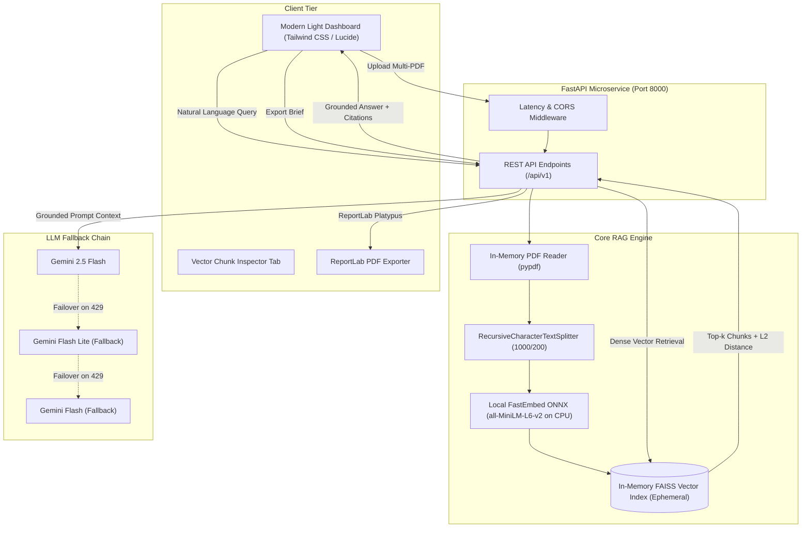

# DocuVault AI: Grounded Multi-Document RAG Microservice

[](https://github.com/Dhruv-Panwar042/DocuVault-AI/actions/workflows/ci.yml)
[](LICENSE)
[](https://www.python.org/downloads/)
[](https://fastapi.tiangolo.com)
[](Dockerfile)
[](https://docuvault-ai-ah83.onrender.com/)

**Live Service:** [https://docuvault-ai-ah83.onrender.com/](https://docuvault-ai-ah83.onrender.com/) &nbsp;|&nbsp; **API Docs:** [https://docuvault-ai-ah83.onrender.com/docs](https://docuvault-ai-ah83.onrender.com/docs)

A lightweight, decoupled Retrieval-Augmented Generation (RAG) microservice built with **FastAPI**, **in-memory FAISS** vector indexing, and **local ONNX embeddings**, engineered for memory-constrained cloud environments (sub-256 MB RAM) with grounded LLM question answering and automated ReportLab PDF brief export.

Built with **FastAPI**, **LangChain**, **FAISS-CPU**, local **`all-MiniLM-L6-v2`** embeddings via **FastEmbed** (zero embedding API cost), and **Google Gemini 2.5 Flash** with sequential multi-model fallback routing.

---

## 🎯 Key Technical Highlights

1. **Zero Embedding API Cost (Local ONNX CPU Inference)**:
   - Uses `fastembed` ONNX Runtime (`sentence-transformers/all-MiniLM-L6-v2`) executing locally on CPU.
   - Generates 384-dimensional dense vectors with normalized cosine similarity without incurring commercial embedding API charges or hitting remote rate limits.
   - Slashes peak indexing RAM by **53%** compared to PyTorch (~235 MB vs. ~500 MB), staying safely within free-tier container ceilings (Render 512 MB).

2. **In-Memory RAM Document Ingestion**:
   - Parses multi-file PDFs directly from memory byte buffers (`io.BytesIO`) using `pypdf`, eliminating temporary disk writes and file-locking pitfalls in containerized environments.

3. **Grounded Answer Confidence Rating**:
   - Computes L2 similarity distance metrics for retrieved vector chunks and maps them to transparent confidence tiers:
     - **High Confidence**: L2 distance $\le 0.5$
     - **Medium Confidence**: L2 distance $\le 1.0$
     - **Low Confidence**: L2 distance $> 1.0$

4. **Sequential LLM Fallback Routing**:
   - Multi-tier fallback chain (`gemini-2.5-flash` $\rightarrow` `gemini-flash-lite-latest` $\rightarrow` `gemini-flash-latest`) handling API rate limits (HTTP 429) or transient provider outages without dropping user requests.

5. **Vector Chunk Inspector**:
   - Built-in UI tab and paginated REST endpoint (`/api/v1/chunks`) allowing developers and auditors to inspect raw semantic chunks (1,000 characters, 200 overlap), character counts, and exact source page mappings.

6. **Executive Briefing & ReportLab PDF Export**:
   - Multi-document briefing endpoint synthesizing overarching themes, methodologies, and findings.
   - Programmatic generation of branded PDF intelligence briefs via ReportLab including full Q&A audit trails and citation tables.

---

## ⚖️ Architectural Design Choices & Known Limitations

To evaluate this microservice realistically, the following trade-offs and operational constraints are documented upfront:

### 1. Ephemeral In-Memory Vector Storage (FAISS)
- **Why in-memory?** DocuVault AI was designed as a lightweight, session-based document inspection tool running entirely inside a single container on free-tier infrastructure (512 MB RAM / 0.1 CPU). Using an in-process FAISS index eliminates external database latency, recurring cloud database costs, and operational complexity.
- **The Known Limitation**: Document vectors and metadata exist strictly in Python process memory. **Calling `DELETE /api/v1/clear`, restarting the container, or redeploying the service resets all indexed documents to zero.**
- **Production Evolution**: In a multi-tenant enterprise system, this in-memory layer would be replaced by a managed, persistent vector database (such as PostgreSQL with `pgvector` or Qdrant) with tenant/user isolation, persistent S3 storage for uploaded PDF artifacts, and JWT authentication.

### 2. Local ONNX Embeddings vs. PyTorch vs. Cloud APIs
- **Why FastEmbed (ONNX)?** The initial prototype relied on PyTorch + `sentence-transformers`, consuming ~498 MB of RAM at idle/load—causing immediate kernel OOM restarts on Render's 512 MB tier. Migrating to ONNX Runtime via `fastembed` reduced runtime footprint to ~235 MB peak while preserving local, zero-cost CPU inference.
- **The Known Limitation**: The ONNX model weights (~90 MB) must be pre-cached at container build time. For massive document collections (>50,000 pages), storing all embeddings in RAM would require scaling container memory or using disk-backed ANN indexing (HNSW with memory mapping).

### Memory Benchmark (PyTorch vs. FastEmbed ONNX on 512 MB Host)

| Pipeline Phase | PyTorch + SentenceTransformers | FastEmbed + ONNX Runtime | Improvement |
|---|---|---|---|
| **Base Imports** | 426.7 MB | **77.8 MB** | **82% reduction** |
| **Model In-Memory** | 421.2 MB | **225.0 MB** | **46% reduction** |
| **Peak Indexing RAM** | ~500 MB (Triggered Render OOM) | **~235.2 MB** | **53% reduction** |
| **Headroom on 512MB Host** | ~12 MB (Fatal crash) | **~276.8 MB (Stable)** | **Reliable runtime** |
| **Container Build Size** | ~2.5 GB (PyTorch wheels) | **~500 MB** | **80% smaller image** |

---

## 🏗️ Architecture



---

## 🚀 REST API Endpoints

| Method | Endpoint | Description |
|---|---|---|
| `GET` | `/health` | Liveness probe returning service status and indexing state |
| `GET` | `/api/v1/status` | Current indexed corpus metadata, total pages, and chunk counts |
| `POST` | `/api/v1/upload` | Multi-file PDF upload with in-memory parsing, semantic chunking, and FAISS indexing |
| `POST` | `/api/v1/query` | Dense similarity search with top-$k$ retrieval and grounded LLM reasoning |
| `POST` | `/api/v1/summarize` | Structured multi-document executive briefing synthesis |
| `GET` | `/api/v1/chunks` | Paginated vector chunk inspection for debugging and auditability |
| `POST` | `/api/v1/export/pdf` | Compiles and streams a downloadable ReportLab executive PDF brief |
| `DELETE` | `/api/v1/clear` | Clears all vectors and document cache from memory |

Interactive OpenAPI documentation is available at `/docs` (Swagger UI) and `/redoc`.

---

## 📁 Repository Structure

```
DocuVault-AI/
├── backend/
│   └── app/
│       ├── api/
│       │   └── v1/
│       │       ├── __init__.py
│       │       └── endpoints.py         # REST endpoints: upload, query, summarize, chunks, status, clear, export
│       ├── core/
│       │   └── config.py                # Pydantic v2 settings (env, model params, chunking thresholds)
│       ├── schemas/
│       │   └── rag.py                   # Pydantic models: QueryRequest, QueryResponse, ChunkItem, SourceCitation
│       ├── services/
│       │   ├── gemini_service.py        # Sequential LLM fallback chain (2.5 Flash -> Lite -> Flash)
│       │   ├── rag_service.py           # In-memory PDF parsing, recursive splitting, FAISS index, scoring
│       │   └── report_service.py        # Programmatic ReportLab PDF brief compiler
│       ├── __init__.py
│       └── main.py                      # FastAPI app with latency middleware, CORS, and static asset serving
├── frontend/
│   └── index.html                       # Responsive light UI: Tabbed workspace (Chat, Chunk Inspector, Executive Brief)
├── notebooks/
│   └── RAG_Chatbot.ipynb                # Initial exploratory prototype notebook
├── tests/
│   └── test_rag.py                      # 7 automated tests (health, schemas, chunking, inspector, PDF export)
├── .github/
│   └── workflows/
│       └── ci.yml                       # GitHub Actions CI workflow running pytest on push/PR
├── .env.example                         # Contributor configuration template
├── .gitignore                           # Clean ignores (venv, cache, large PDFs, secrets)
├── Dockerfile                           # Single-container build with ONNX model pre-caching
├── LICENSE                              # MIT License
├── README.md                            # Technical documentation, architectural trade-offs, and benchmarks
├── render.yaml                          # Render infrastructure-as-code blueprint
├── requirements.txt                     # Lightweight dependencies (FastAPI, FastEmbed, FAISS, PyPDF, ReportLab)
└── sample.pdf                           # Test knowledge base document
```

---

## 💻 Quickstart (Local Development)

### 1. Prerequisites
- Python 3.11+
- Git
- Google Gemini API key ([Google AI Studio](https://aistudio.google.com/))

### 2. Clone and Setup
```bash
git clone https://github.com/Dhruv-Panwar042/DocuVault-AI.git
cd DocuVault-AI


# Create virtual environment
python -m venv venv

# Activate virtual environment
# Windows:
.\venv\Scripts\activate
# Linux / macOS:
source venv/bin/activate

# Install dependencies
pip install -r requirements.txt
```

### 3. Configure Environment Variables
Copy the example template and supply your Gemini API key:
```bash
cp .env.example .env
```
Edit `.env`:
```env
GOOGLE_API_KEY=your_gemini_api_key_here
EMBEDDING_MODEL=sentence-transformers/all-MiniLM-L6-v2
GEMINI_MODEL=gemini-2.5-flash
CHUNK_SIZE=1000
CHUNK_OVERLAP=200
```

### 4. Run the Application
```bash
# Set PYTHONPATH and start uvicorn
python -m uvicorn backend.app.main:app --reload --port 8000
```
Open your browser at `http://localhost:8000`.

---

## 🧪 Automated Testing

DocuVault AI includes an automated unit and integration test suite covering health probes, validation rules, in-memory PDF chunking, chunk inspector pagination, and ReportLab PDF binary export:

```bash
# Run pytest
pytest tests/test_rag.py -v
```

---

## 🐳 Docker & Cloud Deployment (Render)

The project includes a production-ready single-container Dockerfile that pre-caches the HuggingFace model at build time, runs as a non-root user, and dynamically binds to `${PORT:-8000}`.

### Build and Run Locally with Docker
```bash
docker build -t docuvault-ai .
docker run -p 8000:8000 -e GOOGLE_API_KEY="your_key_here" docuvault-ai
```

### Deploy to Render (Web Service)
1. Fork or push this repository to GitHub.
2. Log into [Render Dashboard](https://dashboard.render.com/) and click **New + $\rightarrow$ Web Service**.
3. Select this repository: `DocuVault-AI`.
4. Configure service settings:
   - **Environment**: `Docker`
   - **Branch**: `main`
   - **Instance Type**: Free (512 MB RAM / 0.1 CPU)
5. Add Environment Variable:
   - `GOOGLE_API_KEY`: `<Your_Google_AI_Studio_Key>`
6. Click **Create Web Service**. Render builds the image, pre-caches the embedding weights, and launches the service.

---

## 📊 Tech Stack

| Component | Technology | Rationale |
|---|---|---|
| **Web Framework** | FastAPI (ASGI) | Asynchronous request handling and automatic OpenAPI documentation |
| **Embeddings** | FastEmbed (`all-MiniLM-L6-v2`) | ONNX Runtime CPU inference (~78 MB import / ~235 MB peak), 384-dim dense vectors |
| **Vector Store** | FAISS-CPU | In-process similarity search with cosine/L2 distance scoring (zero external DB cost) |
| **Text Splitter** | LangChain `RecursiveCharacterTextSplitter` | Semantic hierarchical chunking preserving paragraph and sentence boundaries |
| **PDF Extraction** | PyPDF (`io.BytesIO`) | Zero-disk RAM extraction avoiding OS file locks and storage leaks |
| **Reasoning LLM** | Google Gemini 2.5 Flash | Fast reasoning engine with structured prompt grounding and fallback chain |
| **Document Export** | ReportLab 4.x / 5.x | Programmatic PDF generation with canvas page numbering and data tables |
| **Frontend** | Tailwind CSS + Lucide Icons | Responsive light UI dashboard with tabbed workspaces |

---

## 👨‍💻 Author

**Dhruv Panwar**  
- GitHub: [@Dhruv-Panwar042](https://github.com/Dhruv-Panwar042)  
- Project Repository: [DocuVault-AI](https://github.com/Dhruv-Panwar042/DocuVault-AI)  


---

## 📄 License

This project is licensed under the [MIT License](LICENSE).